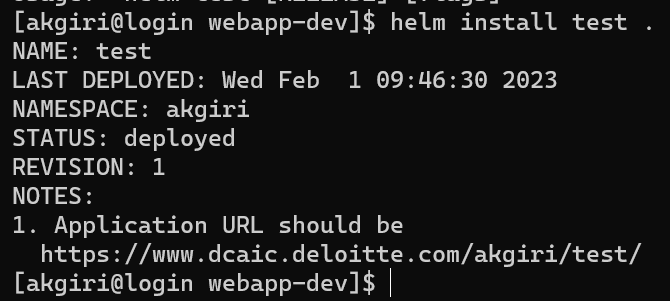
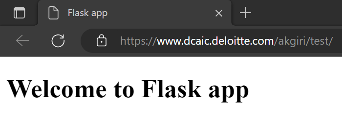
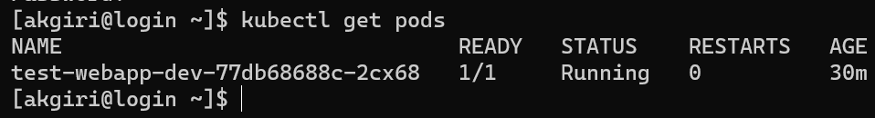
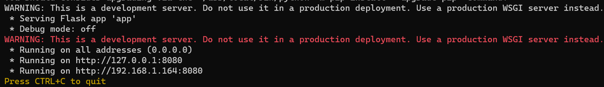

# Simple Flask web app deployment guide on DGX

In this documentation, we'll learn how to deploy a simple flask web application on DGX cluster using helm and kubernetes.

## Prerequisites


1. Setup registry credentials here: [Registry Help - Sections 1.1 and 1.2](https://www.dcaic.deloitte.com/docs/user/registry_help/)
2. Make sure that you’re able to access the following repositories under the Deloitte organization (if not, you need to contact Deloitte GitHub to join the organization):
   1. [simple-flask-webapp](https://github.com/Deloitte/simple-flask-webapp/){:target="\_blank"}
   2. [webapp-dev](https://github.com/Deloitte/webapp-dev/){:target="\_blank"}

## Steps to run your first web app on the DGX


1. Clone the folder `webapp-dev` from [https://github.com/Deloitte/webapp-dev](https://github.com/Deloitte/webapp-dev){:target="\_blank"} in your home directory inside DGX cluster (`/home/AD/<your-username>`)

2. Once you've cloned this folder, the folder structure should look like this:

    ```bash 
        .
        ├──Chart.yaml
        ├──charts
        ├──templates
        │   ├──NOTES.txt
        │   ├──_helpers.tpl
        │   ├──deployment.yaml
        │   ├──pat.yaml
        │   ├──service.yaml
        │   ├──serviceaccount.yaml
        │   ├──startup.yaml
        │   ├──tests
        │   │   └──test-connection.yaml
        │   └──vs.yaml
        └──values.yaml
    ```
        

The main file that we are going to focus on is the `values.yaml` file inside root directory of the `webapp-dev` folder. 

3. In "**values.yaml**", update `<your-PAT>` with your actual GitHub PAT (personal access token) so that you will have access to clone our simple-flask-webapp repository. 
   1. For more information on generating a PAT, go to the **_Creating a personal access token (classic)_** section of [this GitHub link](https://docs.github.com/en/enterprise-cloud@latest/authentication/keeping-your-account-and-data-secure/creating-a-personal-access-token){:target="\_blank"}


       This file contains all the metadata which will be used in other files.

       The following parameters are the key ones that need to be changed in "values.yaml"

       - git > repo: [https://github.com/Deloitte/simple-flask-webapp](https://github.com/Deloitte/simple-flask-webapp){:target="\_blank"}

       - git > pat: `your-git-pat`

       - image > repository : `reg.dcaic.deloitte.com/dcaic/flask-app`

       - image > tag: `"0.1"`

       - imagePullSecrets > name: `regcred`

4. Once you made this change, next you need to run following commands to start up the server:
    - From the root of the folder **webapp-dev**, run

        ```bash
        helm install test . 
        ```
        If everything went well then you should see an output like this:

        

        <br>

        As you can see in the last line, it has given us a URL (in my case, https://www.dcaic.deloitte.com/akgiri/test/). Copy the URL and paste it in the browser. At the beginning you might see a message like `no healthy upstream` in the browser. Give it approximately 10 minutes and then you should see a page like this: 

        

        While the app gets deployed, you can check the status of the deployment by running following commands:

    - To check your pod name, run the following:
        ```bash
        kubectl get pods
        ```
        This command will list out the running pods like this

        

        Here you can see that "READY" status is 1/1 which means the pod is deployed successfully. If there was any problem, the status would have been 0/1.  
    
    - In case the deployment was not successful or you want to check the logs, run

        ```bash
        kubectl logs <pod-name> -f
        ```

        Running this command will show an output like this:

        

## Modifying this tutorial for your use case

In the above tutorial we deployed a sample Flask web app. In case you want to deploy your own application,
the following parameters are the key ones you need to understand:

1. In **values.yaml**,


    - git > repo: `<your-GitHub-repository-link>`

        >This is the link to the flask application repository which you want to deploy. Make sure that your flask application runs on `port 8080`. If your application runs on some other port, it's highly recommended that you change it to port 8080. Otherwise the application might not run based on other configurations. 
       

    - git > pat: `<your-git-pat>`

        > Git PAT is your GitHub personal access token. You can see your active tokens from [GitHub Tokens](https://github.com/settings/tokens){:target="\_blank"}. You can also see the reference guide on how to create a personal access token by going to the **_Creating a personal access token (classic)_** section of [this GitHub link](https://docs.github.com/en/enterprise-cloud@latest/authentication/keeping-your-account-and-data-secure/creating-a-personal-access-token){:target="\_blank"}


    - image > repository : `<link-to-hosted-docker-image>`

        > `image > repository` is the link to the docker image inside which your application will run. This image is hosted in our Harbor registry. The docker image in the example contains some of the common dependencies to run a flask application. If you need more dependencies, you can build your own image and host it on Harbor and put the link here (see [Registry Help](https://www.dcaic.deloitte.com/docs/user/registry_help/){:target="\_blank"} for more info).

    - image > tag: `<docker-image-tag>`


        > `image > tag` is the tag of the docker image which we discussed in the above point. 
        

    - imagePullSecrets > name: `<name>`

        > As the name suggests, `imagePullSecrets` is the secret credentials to pull your Docker images from Harbor to DGX cluster. You should not need to change this from `regcred`, which is the default name specified in [Registry Help Section 1.2](https://www.dcaic.deloitte.com/docs/user/registry_help/){:target="\_blank"}.


## Understanding the entire deployment


When we run the `helm install test .` command, the following are the main steps that are performed:

1. From the `values.yaml` file, the Docker image specified in the `image > repository` parameter is pulled down and spun up in a container. Image pull secrets are set in the `imagePullSecrets > name` parameter to give access to pull images from our Harbor registry. 


2. From the `startup.yaml` file, a script is created inside that Docker container named `startup.sh`, which has following content, 


```yaml
    #!/bin/bash
    echo "Cloning ${GIT_REPO}"
    git clone -c credential.helper= -c credential.helper='!f() { echo username=author; echo "password=${GIT_PAT}"; };f' ${GIT_REPO}
    if [[ $? -ne 0 ]]; then
    echo "Cloning failed. Aborting"
    exit 1
    fi
    basename=$(basename ${GIT_REPO})
    appname=${basename%.*}
    cd ${appname}
    ls -la
    {{- .Values.startupCommand | toYaml | indent 2 }}
```

As we can see in the above script, it clones the main Flask project repository with the given GitHub url and credentials. The variables `GIT_REPO` and `GIT_PAT` are set in the `deployment.yaml` as environment variables like this:


```yaml
    env:
        - name: "URL_SUBPATH"
        value: "/{{ .Release.Namespace }}/{{ .Release.Name }}/"
        - name: "GIT_REPO"
        value: {{ .Values.git.repo }}
        - name: "GIT_PAT"
        valueFrom:
            secretKeyRef:
            name: {{ .Release.Name }}-pat
            key: git-pat
```

These variables are populated from the associated values set in the `values.yaml` file. <br>
For example, we can see that for `GIT_REPO` the value is `Values.git.repo` which is the `git > repo` parameter in `values.yaml`. 

3. Once the project is cloned inside the container, a final startup command is run as the last line of the above `startup.yaml` script (the line with `.Values.startupCommand` in it). This startup command is defined in the `values.yaml` file: 

```yaml
    startupCommand: |
        pip3 install -r requirements.txt
        # execute the launch command
        python3 -u app.py
```


As we can see, there are two commands that it runs:

- First, it installs any requirements which are mentioned inside the `requirements.txt` file in the root of your project directory 
- Second, it actually runs the flask application with the python command `python3 -u app.py`

If everything goes right, your application gets hosted on a particular url which you can open in a browser, as discussed above.


